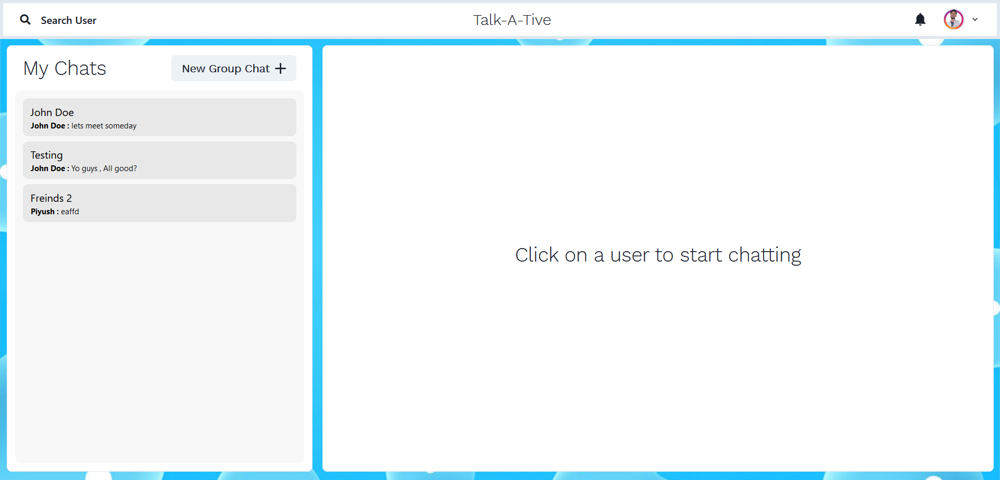

# Talk-A-Tive

Talk-a-tive is a Full Stack Chatting App.
Uses Socket.io for real time communication and stores user details in encrypted format in Mongo DB Database.

## Tech Stack

**Client:** React JS

**Server:** Node JS, Express JS

**Database:** Mongo DB
  
## Demo

[https://talk-a-tive.herokuapp.com/](https://talk-a-tive-7fgq.onrender.com)


## Run Locally

Clone the project

```bash
  git clone https://github.com/DevDK12/mern-chat-app.git
```

Go to the project directory

```bash
  cd mern-chat-app
```

Install dependencies

```bash
  npm install
```

```bash
  cd frontend/
  npm install
```

Start the server

```bash
  npm run start
```
Start the Client

```bash
  //open now terminal
  cd frontend
  npm start
```

  
# Features

### Authenticaton


### Real Time Chatting with Typing indicators


### One to One chat


### Search Users


### Create Group Chats


### Notifications 


### Add or Remove users from group


## Made By

- [@devdk12](https://github.com/DevDK12)

  
